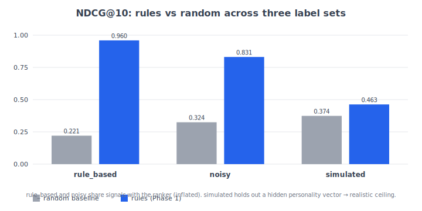
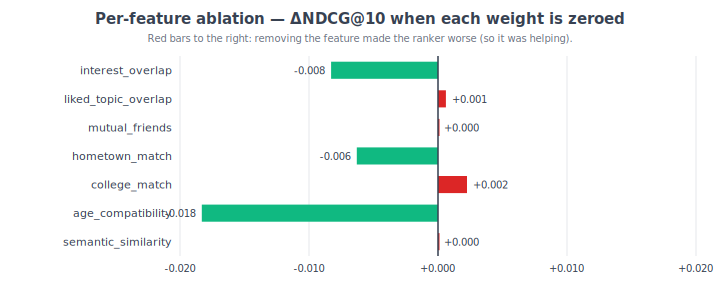
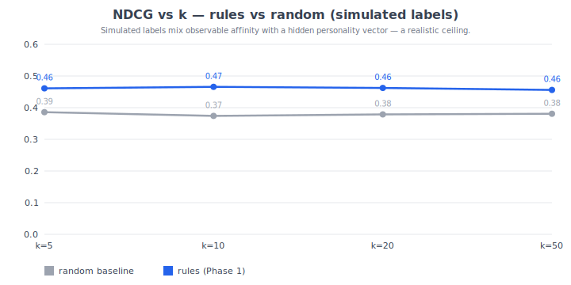

# Hangpost Matching Engine

[](https://github.com/ai-bryguy101/hangpost-app/actions/workflows/ci.yml)
[](https://github.com/ai-bryguy101/hangpost-app/actions/workflows/ci.yml)
[](LICENSE)
[](https://huggingface.co/spaces/REPLACE_ME/hangpost-matching-demo)

A friend-recommendation engine for a location-based social app. Three rankers
behind one `Ranker` Protocol — each phase is measured against a held-out query
set, and the strongest one ships:

1. **Phase 1 — Rules.** Deterministic weighted scoring (Jaccard interest/topic
   overlap, mutual-friend ratio, hometown match, college match,
   age-compatibility ladder) sorted via a three-lane policy: mutual
   friends → shared hometown/college → everyone else, with the weighted
   `total_score` deciding order *within* each lane. Hometown and
   college are peer-strength friendship cues with equal default
   weights — a candidate can match on one without the other.
2. **Phase 2 — Embeddings.** Adds `semantic_similarity` from
   `sentence-transformers/all-MiniLM-L6-v2`. The text that gets embedded is
   *auto-synthesized* from each user's structured fields by
   `profile_to_text` — Hangpost users never write a bio.
3. **Phase 3 — Learned.** A LightGBM `LGBMRanker` (LambdaRank objective)
   trained on the same features as Phase 1+2, learning the weights from
   labeled query data.
4. **Phase 3.5 — LLM-as-judge labels.** Send each (source, candidate)
   pair to Claude with a rubric grounded in the product spec, cache
   verdicts to JSONL, then evaluate and distill against those labels —
   the canonical teacher → student pattern. The synthetic
   `relevance_fn`s are still available as a cost-free fallback.

All three are evaluated by the same harness (`hangpost_matching.evaluation`)
which implements precision@k / recall@k / NDCG@k / MAP@k from scratch.

## Results at a glance

> Generated by `python scripts/make_plots.py` from `data/test_profiles.csv`
> (1,000 synthetic profiles, 100 queries, seed=42). Regenerate any time the
> ranker changes and the README stays in sync.

### Rules vs random across three label sets



The rules ranker pins near 1.0 on its own `rule_based` labels — that's the
**label-leakage tell**, not a real win. The `simulated` column is the honest
ceiling: relevance is sampled from a logistic mixture of observable affinity
and a *hidden per-user personality vector the ranker can't see*. That's the
gap a learned ranker has to close.

### Which signal is actually carrying the ranker?



Each row zeroes one weight in `ScoringWeights` and reports the NDCG drop vs.
the full-weights baseline. Red to the right = removing the feature made the
ranker worse, so the feature was actually helping. Green to the left = the
feature was net-noise on this label set — a candidate for pruning.

### Ranking quality at varying cutoffs



The rules ranker holds its lead from k=5 to k=50 on the realistic label set —
i.e., it's not just getting lucky on the top result.

## Live demo

Try the engine in your browser — pick a source profile, see the top-10
recommendations with a full per-candidate `MatchBreakdown` showing exactly
why each one ranked where it did:

**[hangpost-matching-demo on HuggingFace Spaces →](https://huggingface.co/spaces/REPLACE_ME/hangpost-matching-demo)**

The Space is built from [`space/`](space/) and re-installs the package
straight from this repo at boot, so the demo never drifts from `main`.

## Quickstart

```bash
python -m venv .venv && source .venv/bin/activate
pip install -e ".[dev]"

pytest                       # run the full test suite
python examples/demo.py      # rules-only ranking on a hand-built example
python scripts/evaluate.py   # rules vs random baseline on the seed CSV
```

To use the ML phases (sentence-transformers + LightGBM):

```bash
pip install -e ".[ml]"
python examples/embeddings_demo.py        # Phase 2: semantic similarity
python scripts/train.py --with-embeddings # Phase 3: train + held-out comparison
python scripts/evaluate.py --with-embeddings \
    --learned-model models/learned_ranker.joblib
```

To label and distill with Claude as the teacher (Phase 3.5):

```bash
pip install -e ".[ml,judge]"
export ANTHROPIC_API_KEY=...

# Send pairs to Claude, cache verdicts to JSONL (idempotent — re-runs only
# call the API for new pairs):
python scripts/label.py --queries 30 --top-k 15 --random-k 15

# Evaluate every ranker against the judge's labels:
python scripts/evaluate.py --labels data/judge_labels.jsonl

# Distill: train LightGBM on the judge's labels.
python scripts/train.py --labels data/judge_labels.jsonl --with-embeddings
```

To deploy as an HTTP service:

```bash
pip install -e ".[ml,serve]"
HANGPOST_MODE=embeddings uvicorn hangpost_matching.server:app --host 0.0.0.0 --port 8000
# or, with Docker:
docker build -t hangpost-matching .
docker run --rm -p 8000:8000 -e HANGPOST_MODE=embeddings hangpost-matching
```

## Architecture

```
                          ┌────────────────────────────────────┐
                          │   Candidate retrieval (upstream)   │
                          │   Hard radius pre-filter — geo     │
                          │   index, NOT a ranking signal.     │
                          └───────────────┬────────────────────┘
                                          │
                                          ▼  list[UserProfile]
                          ┌────────────────────────────────────┐
       profile_to_text ──▶│           Embedder (Phase 2)       │──▶ {user_id: vector}
       (structured →      │  SentenceTransformerEmbedder       │
        natural-lang)     │  / OpenAI / Cohere / your own      │
                          └───────────────┬────────────────────┘
                                          │
                                          ▼
   ┌────────────────────────────────────────────────────────────────────────┐
   │                            Ranker contract                             │
   │   def __call__(source, candidates) -> list[user_id]                    │
   ├──────────────────────────┬───────────────────────────┬─────────────────┤
   │  rules (Phase 1+2)       │   learned (Phase 3)       │  random base    │
   │  rank_candidates(...)    │   LearnedRanker.rank(...) │  shuffle(seed)  │
   └──────────────────────────┴───────────────────────────┴─────────────────┘
                                          │
                                          ▼
                          ┌────────────────────────────────────┐
                          │  evaluate_ranker — P@k R@k NDCG MAP│
                          └────────────────────────────────────┘
```

## How "location" works in Hangpost (important)

Hangpost is a location-based app, but **physical distance is not a ranking
signal**.

- **Current location (real-time)** is a *hard pre-filter*: the app only ever
  shows users profiles within a small radius of where they are right now.
  Profiles outside the radius are removed before the matching engine runs.
- **Hometown** is a *soft matching signal*: two users from the same hometown
  rank higher because shared origin is a friendship cue.
- **College** is a peer-strength signal to hometown — same alma mater is
  weighted equally and contributes independently (you can match on
  college, hometown, both, or neither).

This separation keeps the matching engine focused on compatibility while the
upstream candidate-retrieval layer (database / geo-index) enforces the radius.

## Repository layout

```
src/hangpost_matching/
    models.py        UserProfile / ScoringWeights / MatchBreakdown
    scoring.py       compute_match_score, rank_candidates, two-lane sort
    embeddings.py    profile_to_text, cosine, Embedder Protocol
    evaluation.py    P@k, R@k, NDCG@k, MAP@k, query/ranker helpers
    learning.py      extract_features, LearnedRanker (LightGBM)
    data.py          shared CSV → UserProfile loader
    server.py        FastAPI deployment (gated on [serve] extra)
scripts/
    evaluate.py      compare random / rules / rules+embeddings / learned
    train.py         fit + evaluate + persist a LearnedRanker
    label.py         run Claude-as-judge labelling job (Phase 3.5)
    make_plots.py    regenerate the README's SVG charts from current code
examples/
    demo.py                 minimal rules-only ranking example
    embeddings_demo.py      Phase 2 with a real sentence-transformer
    random_sample_ranking.py  ad-hoc ranking on a CSV sample
notebooks/
    01_eda.ipynb            dataset exploration with plots
    02_evaluation.ipynb     phase 1/2/3 head-to-head comparison
docs/
    MODEL_CARD.md           intended use, factors, ethical considerations
    DATA_CARD.md            schema, provenance, sensitive attributes
    img/                    SVG charts inlined at the top of this README
space/
    app.py                  Gradio UI deployed to HuggingFace Spaces
    requirements.txt        installs hangpost-matching from this repo at boot
tests/                      ruff + mypy + 76 pytest tests
```

## Offline evaluation

`scripts/evaluate.py` compares random / rules-only / rules+embeddings /
learned on a query set drawn from the seed CSV. Pick how labels are
generated with `--relevance`:

| Generator | What it does | When to use |
|---|---|---|
| `rule_based` *(default)* | Thresholded multi-signal rule from `synthesize_relevance`. | Sanity check; matches historical baselines. |
| `noisy` | `rule_based` with deterministic per-pair Bernoulli flips. | Robustness / label-noise ablations. |
| `simulated` | Outcomes sampled from a logistic mixture of continuous observable affinity **and** a hidden per-user "personality" vector the ranker cannot see, with Bernoulli noise on top. | Realistic ceiling — keeps the rules baseline honest and gives the learned ranker room to win. |

All three are pure functions of `(source, candidate)` once a seed is
fixed, so train/test splits stay reproducible.

```bash
python scripts/evaluate.py                          # rule_based labels
python scripts/evaluate.py --relevance simulated    # realistic ceiling
python scripts/evaluate.py --ablation               # per-feature weight ablation
python scripts/evaluate.py --with-embeddings \
    --relevance simulated \
    --learned-model models/learned_ranker.joblib
```

`--ablation` zeroes each weight in `ScoringWeights` in turn and reports
the metric drop vs. the full-weights baseline. A positive ΔNDCG means
the ranker got worse without that signal, so the feature was actually
carrying weight; a near-zero delta is a sign you can probably drop the
feature without anyone noticing.

Sample output (50 queries, k=10, no `[ml]` extra, `rule_based` labels):

```
System                     P@10     R@10   NDCG@10    MAP@10
--------------------------------------------------------------
random                    0.196    0.013     0.188     0.079
rules_only                0.982    0.067     0.988     0.979
```

The `rules_only` row pinning near 1.0 is the label-leakage tell —
`rule_based` labels share their features with the rules ranker. Run with
`--relevance simulated` to see realistic numbers; the full Phase 1 / 2 / 3
comparison and plots live in `notebooks/02_evaluation.ipynb`.

## Experiment tracking

`scripts/train.py` can log every run to MLflow. The tracker is fully
optional and lazily imported — without `--mlflow` nothing about
training changes.

```bash
pip install -e ".[ml]"                  # mlflow ships in the [ml] extra
python scripts/train.py --mlflow --relevance simulated --with-embeddings

mlflow ui --backend-store-uri ./mlruns  # browse runs at http://localhost:5000
```

Each run logs:

- **Params** — dataset path, query count, seed, train fraction, k,
  `--relevance` choice, embeddings on/off, `n_estimators`, `learning_rate`,
  `num_leaves`, train/test query counts.
- **Metrics** — precision/recall/NDCG/MAP at k for every ranker that runs
  on the held-out split (`random`, `rules_only`, `rules+embeddings`,
  `learned`), namespaced by ranker so dashboards diff cleanly.
- **Artifact** — the saved `LearnedRanker.joblib`.

## Deploying the demo (HuggingFace Spaces)

The [`space/`](space/) directory is a self-contained HuggingFace Space:
`app.py` is a Gradio UI, `requirements.txt` pulls `hangpost-matching`
straight from this GitHub repo at boot, and `data/test_profiles.csv` is
copied in so the demo works without external storage.

To deploy (one-time setup):

```bash
# 1. Create a new Space on https://huggingface.co/new-space
#    SDK: Gradio · Hardware: CPU basic (free tier is fine)

# 2. Add the new Space as a git remote and push the space/ subtree.
huggingface-cli login                          # one-time, paste your HF token
git remote add hf https://huggingface.co/spaces/<your-username>/hangpost-matching-demo
git subtree push --prefix=space hf main

# 3. Replace REPLACE_ME in the badges/links at the top of README.md with
#    your HuggingFace username.
```

After the first push, future updates are one command:

```bash
git subtree push --prefix=space hf main
```

## Test discipline

Heavy ML dependencies (`numpy`, `sentence-transformers`, `lightgbm`,
`joblib`, `fastapi`) are confined to optional extras and imported lazily.
CI installs only `[dev]` and runs the full test suite against stubs
satisfying the `Embedder` and `Predictor` Protocols. Real model behaviour is
exercised by `scripts/train.py`, `scripts/evaluate.py`, the notebooks, and
the Docker image — none of which the test suite touches.

## License

MIT — see `LICENSE`.
